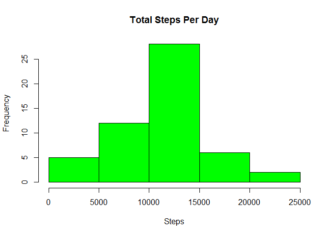
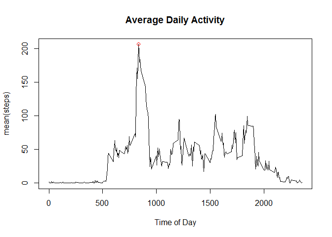
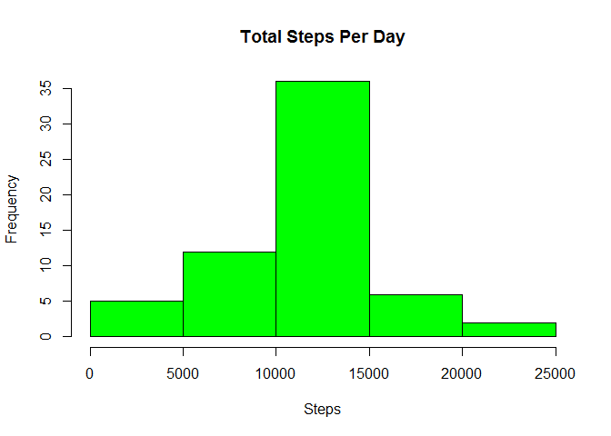

# Reproducible Research: Peer Assessment 1


## Loading and preprocessing the data

 Read the "activity.csv" file.  I preprocess by converting date to POSIXct format
 which is friendly to dplyr.  Interval is hours * 100 + minutes.


```r
activity <- read.csv("activity/activity.csv")
activity$cdate <- as.POSIXct(activity$date)
```

## What is mean total number of steps taken per day?
### Calculate the total number of steps taken per day

I use dplyr to chain, selecting the columns for continuous date and steps, removing
any na values, grouping it by date and taking the total of steps taken.

```r
library(dplyr)
(tot_steps <- activity %>%
        select(cdate,steps) %>%
        filter(!is.na(steps)) %>%
        group_by(cdate) %>%
        summarize(sum(steps)))
```

```
## Source: local data frame [53 x 2]
## 
##         cdate sum(steps)
##        (time)      (int)
## 1  2012-10-02        126
## 2  2012-10-03      11352
## 3  2012-10-04      12116
## 4  2012-10-05      13294
## 5  2012-10-06      15420
## 6  2012-10-07      11015
## 7  2012-10-09      12811
## 8  2012-10-10       9900
## 9  2012-10-11      10304
## 10 2012-10-12      17382
## ..        ...        ...
```
# Make a histogram of the total number of steps taken each day

```r
hist(tot_steps$`sum(steps)`,main="Total Steps Per Day",xlab="Steps",col="green")
```

 

# Calculate and report the mean and median of the total number of steps taken per day

```r
(dlymeanwithna <- mean(tot_steps$`sum(steps)`))
```

```
## [1] 10766.19
```

```r
(dlymedianwithna <- median(tot_steps$`sum(steps)`))
```

```
## [1] 10765
```
## What is the average daily activity pattern?
### Make a time series plot of the 5-minute interval and the average number of steps
Which 5-minute interval, on average across all the days in the dataset, contains the
maximum number of steps?  

```r
avg_day <- activity %>%
        select(steps,interval) %>%
        filter(!is.na(steps)) %>%
        group_by(interval) %>%
        summarize(mean(steps))
plot(avg_day,type="l",xlab="Time of Day",main="Average Daily Activity")

day_max <- max(avg_day$`mean(steps)`)
max_int <- avg_day[which(avg_day$`mean(steps)`==day_max),1]
points(max_int,day_max,col="red")
```

 

```r
print(max_int)
```

```
## Source: local data frame [1 x 1]
## 
##   interval
##      (int)
## 1      835
```

## Imputing missing values
## calculate number of missing values

```r
step_na <- activity %>%
        select(steps) %>%
        filter(is.na(steps))

tot_miss = nrow(step_na)
print(tot_miss)
```

```
## [1] 2304
```
## create a new data set filling in missing values using mean value for that time of day

```r
clean_act <- activity
clean_act$rep <- avg_day$`mean(steps)`[match(clean_act$interval,avg_day$interval)]
clean_act$steps[is.na(clean_act$steps)] <- clean_act$rep[is.na(clean_act$steps)]          

ctot_steps <- clean_act %>%
        select(cdate,steps) %>%
        filter(!is.na(steps)) %>%
        group_by(cdate) %>%
        summarize(sum(steps))
```
# Make a histogram of the total number of steps taken each day

```r
hist(ctot_steps$`sum(steps)`,main="Total Steps Per Day",xlab="Steps",col="green")
```

 
# Calculate and report the mean and median of the total number of steps taken per day

```r
(cdlymeanwithna <- mean(ctot_steps$`sum(steps)`))
```

```
## [1] 10766.19
```

```r
(cdlymedianwithna <- median(ctot_steps$`sum(steps)`))
```

```
## [1] 10766.19
```
# Do the values differ from the estimates from the first part of the assignment?

```r
print("Difference in mean from filling in the NA values:")
```

```
## [1] "Difference in mean from filling in the NA values:"
```

```r
print(cdlymeanwithna-dlymeanwithna)
```

```
## [1] 0
```

```r
print("Difference in median from filling in the NA values:")
```

```
## [1] "Difference in median from filling in the NA values:"
```

```r
print(cdlymedianwithna-dlymedianwithna)
```

```
## [1] 1.188679
```

```r
print("Difference in total number of steps from filling in the NA values:")
```

```
## [1] "Difference in total number of steps from filling in the NA values:"
```

```r
print(sum(ctot_steps$`sum(steps)`)-sum(tot_steps$`sum(steps)`))
```

```
## [1] 86129.51
```
## Are there differences in activity patterns between weekdays and weekends?
Create a new factor variable in the dataset with two levels - "weekday" and "weekend"
indicating whether a given date is a weekday or a weekend day.

```r
clean_act$wdy <- weekdays(clean_act$cdate)
clean_act$type <- factor(ifelse(clean_act$wdy=="Saturday"|clean_act$wdy=="Sunday","weekend","weekday"))
```
Make a panel plot containing a time series plot of the 5-minute interval and the average
number of steps taken, averaged across all weekday days or weekend days.

```r
avg_type <- clean_act %>%
        select(steps,type,interval) %>%
        group_by(type,interval) %>%
        summarize(mean(steps))
        
library(lattice)
xyplot(avg_type$`mean(steps)`~avg_type$interval | factor(avg_type$type), layout=c(1,2),type="a",xlab="Interval",ylab="Number of steps")
```

 
